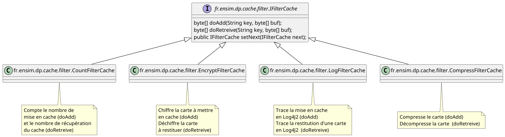

# Travaux Pratiques Design Patterns

## Objectifs
Comprendre les design patterns :
* Singleton
* Factory
* Composite
* Adaptor
* Chaine de responsabilité
* State

## Configuration
### Maven et proxy
Créer le fichier settings.xml dans votre répertoire $home/.m2
```
<?xml version="1.0" encoding="UTF-8"?>
<settings xmlns="http://maven.apache.org/SETTINGS/1.0.0"
xmlns:xsi="http://www.w3.org/2001/XMLSchema-instance"
xsi:schemaLocation="http://maven.apache.org/SETTINGS/1.0.0
http://maven.apache.org/xsd/settings-1.0.0.xsd">
<proxies>
<proxy>
<active>true</active>
<protocol>http</protocol>
<host>proxy.univ-lemans.fr</host>
<port>3128</port>
<nonProxyHosts>*.univ-lemans.fr</nonProxyHosts>
</proxy>
</proxies>
</settings>
```
### Import du projet dans IntelliJ IDEA
```
1. File --> New --> Project from existing sources
2. Sélectionnez le répertoire du projet à importer
3. Choisir maven
```


# Projet OpenStreetMap


## 1. Cache des tuiles


### 1.1 Cache mémoire
Écrire un cache mémoire pour éviter de solliciter OpenStreetMap pour une tuile déjà récupérée.

Créer et implémenter la classe ```fr.ensim.dp.cache.MemoryCache```

### 1.2 Cache disque
Écrire un cache disque pour éviter de solliciter OpenStreetMap pour une tuile déjà récupérée avec un cache disque par type de map :
* Mapnik
* OSM France
* Transport OpenPtMAp

Créer et implémenter la classe ```fr.ensim.dp.cache.DiskCache```

## 2. Factory de cache
Écrire une factory pour obtenir un cache mémoire ou un
cache disque.

package [fr.ensim.dp.cache](src/main/java/fr/ensim/dp/cache/)

## 3. Adaptor


La classe ```org.jdesktop.swingx.mpviewer.TileCache``` offre la mise en cache des tuiles avec SwingX

Ecrire des adapteurs de cette classe pour le cache mémoire et cache disque.

## 4. Filtre


Nous souhaitons appliquer un ou plusieurs filtres ci-dessus sur les opérations de mise en cache.

Implémenter les filtres dans le package [fr.ensim.dp.cache.filter](src/main/java/fr/ensim/dp/cache/filter)

## 5. Player


Implementer un player de trace gps suivant le diagramme ci-dessus
package [fr.ensim.dp.map.player](src/main/java/fr/ensim/dp/map/player)

## 6. Composite
Utilisez le pattern composite pour compter la taille d'un répertoire et ses sous répertoires.

package [fr.ensim.dp.composite](src/main/java/fr/ensim/dp/composite/)
